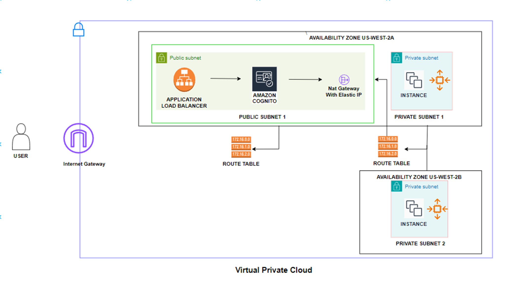

# IBM Terraform Automation

  

IBM Terraform Automation is a project that automates the building of a network and the deployment of a web application using [Terraform](https://developer.hashicorp.com/terraform/intro). Specifically, this project deploys a React application on an [AWS VPC](https://docs.aws.amazon.com/vpc/latest/userguide/what-is-amazon-vpc.html).

## Prerequisites

Install [AWS CLI](https://docs.aws.amazon.com/cli/latest/userguide/getting-started-install.html)

Setup [AWS credentials](https://docs.aws.amazon.com/cli/latest/userguide/cli-chap-configure.html)

Install [Terraform CLI](https://developer.hashicorp.com/terraform/tutorials/aws-get-started/install-cli)

## Usage

In main.tf, change the backend to fit your needs.

After running the below:

```
terraform init
terraform plan
terraform apply
```

The terminal should have output containing the domain name of the application:

```
output: hostname.com
```

## Infrastructure

The infrastructure is as below:


## About

This project was developed in under 3 months. This project was made for the [Rensselaer Center for Open Source](https://new.rcos.io/). The project was developed by [Hazel Yu](https://www.linkedin.com/in/hazel-yu-a13b9b26a/), [Ritika Brahmadesam](https://www.linkedin.com/in/bcritika/), [Tyler Du](https://www.linkedin.com/in/tyler-du-link/), [Arnav Mukherjee](https://www.linkedin.com/in/arnav-mukherjee-874a38292/) mentored by IBM Principal Cloud Architect [Pandikumar(Kumar) Swamikrishnan](https://www.linkedin.com/in/pandikumar-swamikrishnan/).

## License

[MIT](https://choosealicense.com/licenses/mit/)
